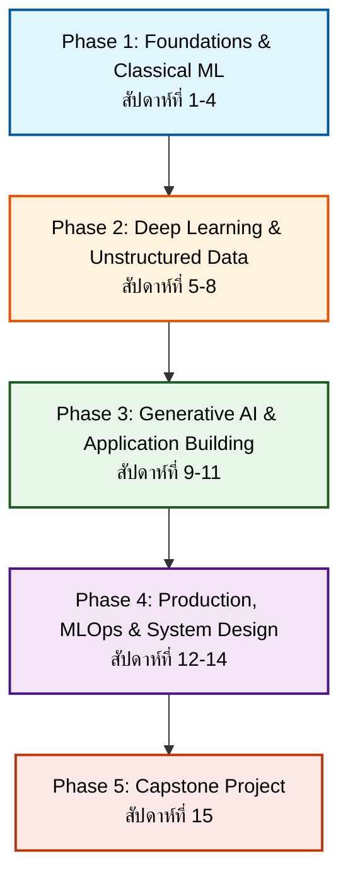

# 🧠 แผนการเรียนหลักสูตร AI & Machine Learning Engineering (15 สัปดาห์)

> [!NOTE] 📌 ข้อมูลโครงสร้างหลักสูตร (Course Overview)
> **โครงสร้างเวลา:** สัปดาห์ละ 6 ชั่วโมง (ทฤษฎี 2 ชม. + 4 เวิร์กชอปย่อย รวม 4 ชม.)  
> **อ้างอิงจากตำราและมาตรฐานสากล:** *Hands-on ML, Designing ML Systems, GenAI Design Patterns, Software Eng. for DS, AI Engineering และ FastAI/PyTorch*

---

## 🗺️ แผนที่เส้นทางการเรียนรู้ (Learning Roadmap)

---

## 📚 สารบัญบทเรียนแยกตาม Phase (Table of Contents)

### 🔹 [[Phase 1 - Overview|Phase 1: Foundations & Classical Machine Learning]]
*(สัปดาห์ที่ 1-4 เน้นปูพื้นฐานการเขียนโค้ดที่ดี และโมเดล ML ดั้งเดิม)*
- 🟢 [[Week 1 - Introduction to ML & Software Engineering Basics]]
  - ภาพรวมของ ML, Project End-to-End, Git & Conda Environment, Pandas/NumPy, Data Cleaning/EDA, Linear Regression
- 🟢 [[Week 2 - Classification, Metrics & Model Selection]]
  - Binary/Multiclass Classification, Precision/Recall/ROC/Confusion Matrix, Cross-validation & GridSearch, SVM
- 🟢 [[Week 3 - Trees, Ensembles & Unsupervised Learning]]
  - Decision Trees, Random Forest, Gradient Boosting (XGBoost/LightGBM), K-Means & PCA
- 🟢 [[Week 4 - Software Engineering for Data Scientists]]
  - OOP for Data Science, Exception Handling & Logging, Memory Profiling, FastAPI for Inference

---

### 🔸 [[Phase 2 - Overview|Phase 2: Deep Learning & Unstructured Data]]
*(สัปดาห์ที่ 5-8 เน้น Deep Learning ด้วย PyTorch/FastAI และ Transformers)*
- 🟡 [[Week 5 - Introduction to Deep Learning (PyTorch & FastAI)]]
- 🟡 [[Week 6 - Computer Vision Advanced]]
- 🟡 [[Week 7 - Natural Language Processing (NLP) Foundations]] *(👉 มีโค้ดและเนื้อหาฉบับสมบูรณ์พร้อมรัน)*
- 🟡 [[Week 8 - The Era of Transformers]]

---

### 🔹 [[Phase 3 - Overview|Phase 3: Generative AI & Application Building]]
*(สัปดาห์ที่ 9-11 เน้น LLMs, Prompt Engineering, RAG และ AI Agents)*
- 🟢 [[Week 9 - Generative AI & Prompt Engineering Masterclass]]
- 🟢 [[Week 10 - Retrieval-Augmented Generation (RAG)]]
- 🟢 [[Week 11 - AI Agents & Model Customization]]

---

### 🔸 [[Phase 4 - Overview|Phase 4: Production, MLOps & System Design]]
*(สัปดาห์ที่ 12-14 นำระบบขึ้น Production, การทำ Monitoring และออกแบบระบบ)*
- 🟣 [[Week 12 - Designing Machine Learning Systems]]
- 🟣 [[Week 13 - Model Deployment & Serving]]
- 🟣 [[Week 14 - MLOps, Monitoring & Maintenance]]

---

### 🏆 [[Phase 5 - Overview|Phase 5: Capstone Project]]
*(สัปดาห์ที่ 15 ประมวลความรู้ทั้งหมด)*
- 🔴 [[Week 15 - End-to-End Capstone Project]]

---

## 💡 วิธีใช้งานคลังความรู้นี้ใน Obsidian
1. **คลิกที่ลิงก์ข้อความ (Wiki-link)** เช่น `[[Week 1 - Introduction to ML...]]` เพื่อเข้าไปดูเนื้อหาทฤษฎีและ Workshop ในแต่ละสัปดาห์
2. กดปุ่ม **Ctrl + G** หรือเปิด **Graph View** เพื่อดูโครงข่ายความสัมพันธ์ของเนื้อหาทั้ง 15 สัปดาห์
3. ในแต่ละบทเรียนจะมี **โค้ด Python** ที่สามารถคัดลอกไปรันใน Jupyter Notebook หรือ VS Code ได้ทันที!
