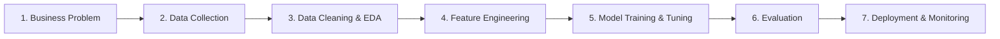

# 🟢 Week 1 - Introduction to ML & Software Engineering Basics

> [!NOTE] 📋 ภาพรวมเนื้อหา (Overview)
> **ทฤษฎี (2 ชม.):** ภาพรวมของ ML, กระบวนการทำโปรเจกต์ ML แบบ End-to-End, แนวปฏิบัติที่ดีในการเขียนโค้ด (Git, Environment)  
> **เวิร์กชอป (Workshops):**
> - **Workshop 1:** การตั้งค่า Environment (Conda/Venv) และ Git Version Control
> - **Workshop 2:** Data Manipulation พื้นฐานด้วย Pandas & NumPy
> - **Workshop 3:** การทำ Data Cleaning และ EDA (Exploratory Data Analysis) เบื้องต้น
> - **Workshop 4:** สร้างโมเดลแรกด้วย Scikit-Learn (Linear Regression) และดูผลลัพธ์

---

## 📖 ส่วนที่ 1: สรุปทฤษฎีสำคัญ (Key Theory Concepts)

### 1. ภาพรวมของ Machine Learning (What is ML?)
Machine Learning คือระบบคอมพิวเตอร์ที่สามารถ**เรียนรู้และพัฒนาความแม่นยำได้จากข้อมูล (Data)** โดยไม่ต้องถูกเขียนโปรแกรมสั่งการกฎเกณฑ์ตายตัว (Explicit Programming) แบ่งออกเป็น 3 ประเภทหลัก:
- **Supervised Learning (เรียนรู้แบบมีผู้สอน):** ข้อมูลมีป้ายกำกับ (Labeled Data) เช่น การทำนายราคาบ้าน (Regression) หรือการแยกภาพแมว/สุนัข (Classification)
- **Unsupervised Learning (เรียนรู้แบบไม่มีผู้สอน):** ข้อมูลไม่มีป้ายกำกับ ระบบค้นหาโครงสร้างหรือกลุ่มเอง เช่น การแบ่งกลุ่มลูกค้า (Clustering)
- **Reinforcement Learning (การเรียนรู้แบบเสริมกำลัง):** โมเดลเรียนรู้ผ่านการลองผิดลองถูก (Trial & Error) จากการได้รับรางวัล (Reward) หรือบทลงโทษ (Penalty)

### 2. กระบวนการทำโปรเจกต์ ML แบบ End-to-End (ML Lifecycle)


---

## 🛠️ ส่วนที่ 2: เวิร์กชอปเชิงปฏิบัติการ (Hands-on Workshops)

### Workshop 1: การตั้งค่า Environment และ Git Version Control
การตั้งค่าสภาพแวดล้อม (Environment) เป็นสิ่งสำคัญในการป้องกันปัญหา Dependency หรือเวอร์ชันของไลบรารีขัดแย้งกัน

```bash
# ----------------------------------------------------
# 1. การสร้าง Environment ด้วย Conda หรือ Venv
# ----------------------------------------------------
# สำหรับ Conda
conda create -n ml_env python=3.10 -y
conda activate ml_env

# สำหรับ Venv (Python พื้นฐาน)
python -m venv ml_env
# เปิดใช้งานใน Windows (Command Prompt)
ml_env\Scripts\activate
# เปิดใช้งานใน macOS/Linux
source ml_env/bin/activate

# ----------------------------------------------------
# 2. การใช้ Git พื้นฐานสำหรับการควบคุมเวอร์ชัน
# ----------------------------------------------------
git init                  # เริ่มต้นระบบ Git ในโฟลเดอร์
git status                # ตรวจสอบสถานะไฟล์
git add .                 # เพิ่มไฟล์ทั้งหมดเตรียมบันทึก (Staging)
git commit -m "init: setup project environment"  # บันทึกเวอร์ชันโค้ด
git branch -M main        # เปลี่ยนชื่อสาขาหลักเป็น main
git remote add origin https://github.com/username/project.git # เชื่อมต่อ GitHub
git push -u origin main   # อัปโหลดโค้ดขึ้น GitHub
```

---

### Workshop 2: Data Manipulation พื้นฐานด้วย Pandas & NumPy
ไลบรารีพื้นฐานที่ Data Scientist และ ML Engineer ต้องใช้สำหรับการจัดการตัวเลขและตารางข้อมูล

```python
import numpy as np
import pandas as pd

# ----------------------------------------------------
# 1. การจัดการข้อมูลด้วย NumPy (Numerical Python)
# ----------------------------------------------------
# สร้าง Array (เวกเตอร์ และ เมทริกซ์)
arr_1d = np.array([10, 20, 30, 40, 50])
arr_2d = np.array([[1, 2], [3, 4], [5, 6]])

print("--- NumPy Statistics ---")
print("Mean:", np.mean(arr_1d))       # หาค่าเฉลี่ย = 30.0
print("Standard Deviation:", np.std(arr_1d)) # หาค่าเบี่ยงเบนมาตรฐาน
print("Matrix Shape:", arr_2d.shape)  # รูปร่างของเมทริกซ์ (3, 2)
print("-" * 40)

# ----------------------------------------------------
# 2. การจัดการข้อมูลตารางด้วย Pandas
# ----------------------------------------------------
# สร้าง DataFrame จาก Dictionary
data = {
    'Name': ['Alice', 'Bob', 'Charlie', 'David'],
    'Age': [25, 30, 35, np.nan],  # ใส่ np.nan จำลองค่าว่าง
    'Salary': [50000, 65000, 80000, 72000],
    'Department': ['IT', 'HR', 'IT', 'Marketing']
}
df = pd.DataFrame(data)

print("--- DataFrame Head ---")
print(df.head())

print("\n--- Summary Statistics ---")
print(df.describe())  # ดูสถิติพื้นฐาน (เฉลี่ย, สูงสุด, ต่ำสุด)
```

---

### Workshop 3: การทำ Data Cleaning และ EDA เบื้องต้น
การสำรวจข้อมูล (Exploratory Data Analysis - EDA) และทำความสะอาดข้อมูล (Clean) ก่อนนำไปใช้ฝึกโมเดล

```python
import pandas as pd
import seaborn as sns
import matplotlib.pyplot as plt

# 1. โหลดชุดข้อมูลตัวอย่าง (Titanic dataset ข้อมูลผู้โดยสารเรือไททานิค)
df = sns.load_dataset('titanic')
print("จำนวนแถวและคอลัมน์:", df.shape)

# 2. การตรวจสอบค่าว่าง (Missing Values)
print("\n--- จำนวนค่าว่างในแต่ละคอลัมน์ ---")
print(df.isnull().sum())

# 3. การจัดการค่าว่าง (Data Cleaning)
# - เติมค่าเฉลี่ยให้คอลัมน์อายุ 'age'
df['age'].fillna(df['age'].mean(), inplace=True)
# - เติมค่าที่พบบ่อยที่สุด (Mode) ให้คอลัมน์ท่าเรือ 'embarked'
df['embarked'].fillna(df['embarked'].mode()[0], inplace=True)

print("\nตรวจสอบค่าว่างหลังทำความสะอาดคอลัมน์ age:", df['age'].isnull().sum())

# 4. Exploratory Data Analysis (EDA) - พล็อตดูกราฟ
plt.figure(figsize=(8, 5))
sns.countplot(data=df, x='survived', hue='sex', palette='Set2')
plt.title("Survival Count by Gender on Titanic (0 = No, 1 = Yes)")
plt.xlabel("Survived")
plt.ylabel("Passenger Count")
plt.show()
```

---

### Workshop 4: สร้างโมเดลแรกด้วย Scikit-Learn (Linear Regression)
เราจะใช้ `Scikit-Learn` สร้างโมเดลทำนายตัวเลขแบบง่าย ๆ (Regression) เพื่อพยากรณ์ราคาบ้านจากพื้นที่ใช้สอย

```python
import numpy as np
from sklearn.model_selection import train_test_split
from sklearn.linear_model import LinearRegression
from sklearn.metrics import mean_squared_error, r2_score

# 1. สร้างข้อมูลจำลอง (พื้นที่บ้าน -> ราคาบ้าน)
# ฟีเจอร์ X: พื้นที่ใช้สอย (ตารางเมตร)
X = np.array([[30], [45], [50], [60], [70], [80], [100], [120], [150], [200]])
# เป้าหมาย y: ราคาบ้าน (ล้านบาท) - จำลองให้มีความสัมพันธ์เชิงเส้นตรง
y = np.array([1.2, 1.8, 2.0, 2.4, 2.8, 3.2, 4.0, 4.7, 5.8, 7.8])

# 2. แบ่งข้อมูลสำหรับ Train 80% และ Test 20%
X_train, X_test, y_train, y_test = train_test_split(X, y, test_size=0.2, random_state=42)

# 3. สร้างและฝึกโมเดล (Train)
model = LinearRegression()
model.fit(X_train, y_train)

# 4. ดูสมการเส้นตรงที่โมเดลเรียนรู้ได้: y = mx + c
print(f"สัมประสิทธิ์ความชัน (Slope / m): {model.coef_[0]:.4f}")
print(f"จุดตัดแกน Y (Intercept / c):    {model.intercept_:.4f}")

# 5. ลองทำนายผล (Predict)
predictions = model.predict(X_test)
print("\n--- ผลการทดสอบทำนายราคาบ้าน ---")
for i in range(len(X_test)):
    print(f"พื้นที่: {X_test[i][0]} ตร.ม. | ราคาจริง: {y_test[i]:.2f} ล. | ทำนายได้: {predictions[i]:.2f} ล.")

# 6. วัดผลความแม่นยำ
mse = mean_squared_error(y_test, predictions)
r2 = r2_score(y_test, predictions) # ค่า R-squared (เข้าใกล้ 1.0 ยิ่งแม่นยำ)
print(f"\nMean Squared Error (MSE): {mse:.4f}")
print(f"R-squared Score (R2):     {r2:.4f} (แม่นยำ {r2*100:.2f}%)")
```

---

## 🔗 อ้างอิงและจุดเชื่อมโยง (Wiki-Links & Next Steps)
- **ภาพรวมเฟส:** [[Phase 1 - Overview|Phase 1: Foundations & Classical Machine Learning]]
- **บทเรียนถัดไป:** [[Week 2 - Classification, Metrics & Model Selection]]
- **ความรู้ที่เกี่ยวข้อง:** [[Python Basics]], [[Git Version Control]], [[Exploratory Data Analysis]]
