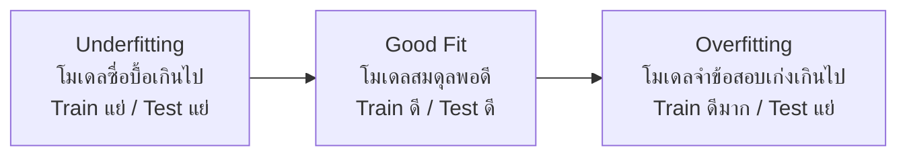

# 🟢 Week 2 - Classification, Metrics & Model Selection

> [!NOTE] 📋 ภาพรวมเนื้อหา (Overview)
> **ทฤษฎี (2 ชม.):** การแยกประเภทข้อมูล, การวัดผล (Precision, Recall, ROC Curve), ปัญหา Overfitting/Underfitting  
> **เวิร์กชอป (Workshops):**
> - **Workshop 1:** การสร้างโมเดล Binary Classification (Logistic Regression / SGD)
> - **Workshop 2:** การจัดการข้อมูลแบบ Multiclass และสร้าง Confusion Matrix
> - **Workshop 3:** การทำ Cross-validation และ Hyperparameter Tuning (GridSearch)
> - **Workshop 4:** การใช้ Support Vector Machines (SVM) และเปรียบเทียบประสิทธิภาพ

---

## 📖 ส่วนที่ 1: สรุปทฤษฎีสำคัญ (Key Theory Concepts)

### 1. การวัดผลโมเดลจำแนกประเภท (Classification Metrics)
การใช้ Accuracy เพียงอย่างเดียวอาจหลอกตาเราได้ (โดยเฉพาะกับข้อมูลที่ไม่สมดุล - Imbalanced Data) เราจึงต้องใช้ตัววัดผลอื่นร่วมด้วย:
- **Precision (ความแม่นยำเมื่อทายว่าถูก):** เมื่อโมเดลทำนายว่าเป็นคลาสบวก มีความถูกต้องกี่เปอร์เซ็นต์ (เหมาะกับงานที่กลัวทายผิดว่า positive เช่น กรองอีเมลสแปม)
- **Recall (ความครอบคลุมในการตรวจจับ):** จากคลาสบวกที่มีอยู่จริงทั้งหมด โมเดลจับได้กี่เปอร์เซ็นต์ (เหมาะกับงานที่ห้ามพลาด เช่น ตรวจหาโรคมะเร็ง)
- **F1-Score:** ค่าเฉลี่ยฮาร์โมนิก (Harmonic Mean) ระหว่าง Precision และ Recall
- **ROC Curve & AUC:** กราฟประเมินความสามารถในการแยกแยะคลาสของโมเดล (AUC เข้าใกล้ 1.0 ยิ่งดี)

### 2. ปัญหา Overfitting และ Underfitting

- **วิธีแก้ Overfitting:** เพิ่มข้อมูล Training, ใช้ Regularization (L1/L2), ลดความซับซ้อนของโมเดล, หรือใช้เทคนิค Cross-Validation

---

## 🛠️ ส่วนที่ 2: เวิร์กชอปเชิงปฏิบัติการ (Hands-on Workshops)

### Workshop 1: การสร้างโมเดล Binary Classification
เรียนรู้การสร้างโมเดลจำแนกข้อมูลที่มีเพียง 2 คลาส (เช่น เป็นโรค หรือ ไม่เป็นโรค) ด้วยอัลกอริทึม `LogisticRegression`

```python
from sklearn.datasets import load_breast_cancer
from sklearn.model_selection import train_test_split
from sklearn.linear_model import LogisticRegression
from sklearn.metrics import accuracy_score, precision_score, recall_score, f1_score

# 1. โหลดชุดข้อมูลผู้ป่วยมะเร็งเต้านม
data = load_breast_cancer()
X, y = data.data, data.target # 0 = Malignant (เนื้อร้าย), 1 = Benign (เนื้อดี)

# 2. แบ่งข้อมูล Train/Test (80/20)
X_train, X_test, y_train, y_test = train_test_split(X, y, test_size=0.2, random_state=42)

# 3. สร้างและฝึกโมเดล Logistic Regression
model = LogisticRegression(max_iter=10000)
model.fit(X_train, y_train)

# 4. ทำนายผลและประเมินประสิทธิภาพด้วย Metrics ต่างๆ
y_pred = model.predict(X_test)

print("--- Binary Classification Results ---")
print(f"Accuracy:  {accuracy_score(y_test, y_pred)*100:.2f}%")
print(f"Precision: {precision_score(y_test, y_pred)*100:.2f}%")
print(f"Recall:    {recall_score(y_test, y_pred)*100:.2f}%")
print(f"F1-Score:  {f1_score(y_test, y_pred)*100:.2f}%")
```

---

### Workshop 2: การจัดการข้อมูลแบบ Multiclass และสร้าง Confusion Matrix
การจำแนกข้อมูลที่มีมากกว่า 2 คลาส และการดูว่าโมเดลทำนาย “สับสน” ที่คลาสไหนด้วย `Confusion Matrix`

```python
import matplotlib.pyplot as plt
import seaborn as sns
from sklearn.datasets import load_iris
from sklearn.metrics import classification_report, confusion_matrix
from sklearn.model_selection import train_test_split
from sklearn.tree import DecisionTreeClassifier

# 1. โหลดข้อมูลดอก Iris (มี 3 สายพันธุ์: Setosa, Versicolor, Virginica)
iris = load_iris()
X_train, X_test, y_train, y_test = train_test_split(iris.data, iris.target, test_size=0.3, random_state=42)

# 2. สร้างโมเดลแบบ Decision Tree
clf = DecisionTreeClassifier(random_state=42)
clf.fit(X_train, y_train)
y_pred = clf.predict(X_test)

# 3. ดูรายงานผลเชิงลึก (Precision, Recall, F1-Score)
print("--- Multiclass Classification Report ---")
print(classification_report(y_test, y_pred, target_names=iris.target_names))

# 4. พล็อต Confusion Matrix เพื่อดูจุดที่โมเดลทายพลาด
cm = confusion_matrix(y_test, y_pred)
plt.figure(figsize=(6, 5))
sns.heatmap(cm, annot=True, cmap='Blues', fmt='d', xticklabels=iris.target_names, yticklabels=iris.target_names)
plt.xlabel('Predicted (สิ่งที่โมเดลทาย)')
plt.ylabel('Actual (ความจริง)')
plt.title('Confusion Matrix - Iris Classification')
plt.show()
```

---

### Workshop 3: การทำ Cross-validation และ Hyperparameter Tuning
การค้นหาค่าพารามิเตอร์ที่ดีที่สุดให้โมเดลแบบอัตโนมัติด้วย `GridSearchCV` เพื่อป้องกันโมเดลจำข้อมูลมากเกินไป (Overfitting)

```python
from sklearn.ensemble import RandomForestClassifier
from sklearn.model_selection import GridSearchCV

# 1. กำหนดช่วงของ Hyperparameter ที่ต้องการให้ระบบทดลองสุ่มหา
param_grid = {
    'n_estimators': [50, 100, 200],  # จำนวนต้นไม้ในป่า
    'max_depth': [None, 5, 10, 15],  # ความลึกสูงสุดของต้นไม้
    'min_samples_split': [2, 5, 10]  # จำนวนข้อมูลขั้นต่ำที่ต้องมีในการแตกกิ่ง
}

# 2. สร้างระบบ GridSearch ที่ใช้ 5-Fold Cross Validation
grid_search = GridSearchCV(
    estimator=RandomForestClassifier(random_state=42), 
    param_grid=param_grid, 
    cv=5,      # ตัดแบ่งข้อมูล 5 ส่วนเพื่อเทสต์สลับกัน (5-Fold CV)
    n_jobs=-1, # ใช้ CPU ทุกคอร์ที่มีให้ประมวลผลเร็วขึ้น
    verbose=1
)

# 3. เริ่มรันหาค่าพารามิเตอร์ที่เจ๋งที่สุด
print("กำลังค้นหา Hyperparameter ที่ดีที่สุดด้วย GridSearch...")
grid_search.fit(X_train, y_train)

print("\n--- ผลลัพธ์จากการทำ Tuning ---")
print("ค่าพารามิเตอร์ที่ดีที่สุด (Best Parameters):", grid_search.best_params_)
print(f"ความแม่นยำเฉลี่ยที่ดีที่สุด (Best CV Score): {grid_search.best_score_*100:.2f}%")
```

---

### Workshop 4: การใช้ Support Vector Machines (SVM) และเปรียบเทียบประสิทธิภาพ
เปรียบเทียบผลลัพธ์ของโมเดล SVM แบบเส้นตรง (Linear Kernel) กับแบบโค้งงอ (RBF Kernel) สำหรับข้อมูลที่มีความซับซ้อน

```python
from sklearn.svm import SVC

# 1. ลองสร้าง SVM Kernel=Linear (ใช้เส้นตรงแบ่งข้อมูล)
svm_linear = SVC(kernel='linear', C=1.0)
svm_linear.fit(X_train, y_train)
acc_linear = svm_linear.score(X_test, y_test)

# 2. ลองสร้าง SVM Kernel=RBF (Radial Basis Function - จัดการแบ่งข้อมูลที่ซับซ้อน/โค้งงอได้)
svm_rbf = SVC(kernel='rbf', C=1.0, gamma='scale')
svm_rbf.fit(X_train, y_train)
acc_rbf = svm_rbf.score(X_test, y_test)

# 3. ลองสร้าง SVM Kernel=Poly (Polynomial - สมการพหุนาม)
svm_poly = SVC(kernel='poly', degree=3)
svm_poly.fit(X_train, y_train)
acc_poly = svm_poly.score(X_test, y_test)

print("--- เปรียบเทียบความแม่นยำของ SVM แต่ละ Kernel ---")
print(f"SVM (Linear Kernel): {acc_linear*100:.2f}%")
print(f"SVM (RBF Kernel):    {acc_rbf*100:.2f}%")
print(f"SVM (Poly Kernel):   {acc_poly*100:.2f}%")
```

---

## 🔗 อ้างอิงและจุดเชื่อมโยง (Wiki-Links & Next Steps)
- **บทเรียนก่อนหน้า:** [[Week 1 - Introduction to ML & Software Engineering Basics]]
- **บทเรียนถัดไป:** [[Week 3 - Trees, Ensembles & Unsupervised Learning]]
- **ความรู้ที่เกี่ยวข้อง:** [[Model Evaluation Techniques]], [[Confusion Matrix Guide]], [[Hyperparameter Optimization]]
