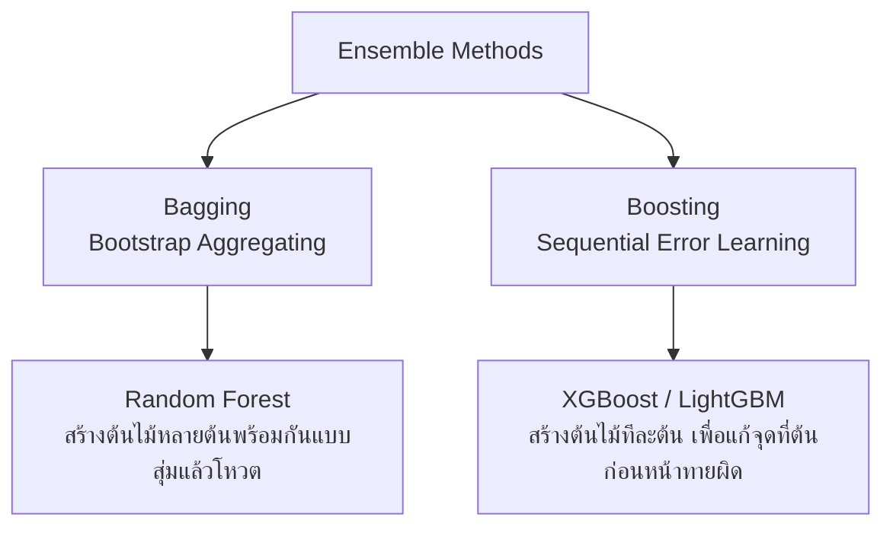

# 🟢 Week 3 - Trees, Ensembles & Unsupervised Learning

> [!NOTE] 📋 ภาพรวมเนื้อหา (Overview)
> **ทฤษฎี (2 ชม.):** หลักการทำงานของ Decision Trees, Ensemble Learning (Bagging, Boosting), K-Means  
> **เวิร์กชอป (Workshops):**
> - **Workshop 1:** สร้างและแสดงภาพ (Visualize) Decision Tree
> - **Workshop 2:** การใช้ Random Forest และดู Feature Importance
> - **Workshop 3:** การใช้ Gradient Boosting (XGBoost หรือ LightGBM)
> - **Workshop 4:** การจัดกลุ่มข้อมูล (Clustering) ด้วย K-Means และ PCA ลดมิติข้อมูล

---

## 📖 ส่วนที่ 1: สรุปทฤษฎีสำคัญ (Key Theory Concepts)

### 1. ต้นไม้ตัดสินใจ (Decision Trees)
เป็นโมเดลที่ทำงานโดยการตั้งคำถามตัดแบ่งข้อมูล (Split) ทีละชั้นเหมือนกิ่งไม้ โดยใช้เกณฑ์ทางคณิตศาสตร์เช่น **Gini Impurity** หรือ **Entropy (Information Gain)**
- **ข้อดี:** เข้าใจง่าย ตีความได้ว่าโมเดลตัดสินใจอย่างไร (White-box model) และไม่ต้องทำ Data Scaling
- **ข้อเสีย:** เกิดปัญหาง่ายมาก (Overfitting) ถ้ายอมให้ต้นไม้ลึกเกินไป

### 2. Ensemble Learning (การรวมพลังโมเดล)
การนำโมเดลหลาย ๆ ตัวมาร่วมกันตัดสินใจเพื่อเพิ่มความแม่นยำและลดความแปรปรวน (Variance)


### 3. การเรียนรู้แบบไม่มีผู้สอน (Unsupervised Learning)
เมื่อข้อมูลไม่มีป้ายกำกับ (No Labels) เราจะใช้โมเดลค้นหาโครงสร้างที่ซ่อนอยู่:
- **K-Means Clustering:** แบ่งกลุ่มข้อมูลออกเป็น $K$ กลุ่ม โดยให้ระยะห่างภายในกลุ่ม (Intra-cluster distance) น้อยที่สุด
- **Principal Component Analysis (PCA):** การลดมิติข้อมูล (Dimensionality Reduction) เช่น จาก 30 ฟีเจอร์ ยุบเหลือ 2-3 มิติ เพื่อตัดสิ่งรบกวน (Noise) และสามารถพล็อตดูเป็นกราฟได้

---

## 🛠️ ส่วนที่ 2: เวิร์กชอปเชิงปฏิบัติการ (Hands-on Workshops)

### Workshop 1: สร้างและแสดงภาพ (Visualize) Decision Tree
เรียนรู้การสร้างต้นไม้ตัดสินใจด้วย Scikit-Learn และพล็อตดูกิ่งก้านการตัดสินใจของโมเดล

```python
import matplotlib.pyplot as plt
from sklearn.datasets import load_wine
from sklearn.model_selection import train_test_split
from sklearn.tree import DecisionTreeClassifier, plot_tree

# 1. โหลดข้อมูลไวน์ (Wine Dataset - 3 สายพันธุ์)
data = load_wine()
X_train, X_test, y_train, y_test = train_test_split(data.data, data.target, test_size=0.3, random_state=42)

# 2. สร้างโมเดล Decision Tree โดยจำกัดความลึกไม่เกิน 3 ชั้นเพื่อไม่ให้กราฟรกเกินไป
tree_model = DecisionTreeClassifier(max_depth=3, criterion='gini', random_state=42)
tree_model.fit(X_train, y_train)

# 3. ประเมินความแม่นยำ
print(f"Decision Tree Accuracy: {tree_model.score(X_test, y_test)*100:.2f}%")

# 4. แสดงภาพต้นไม้ตัดสินใจ (Visualize Tree)
plt.figure(figsize=(15, 8))
plot_tree(tree_model, 
          feature_names=data.feature_names, 
          class_names=data.target_names, 
          filled=True, 
          rounded=True, 
          fontsize=9)
plt.title("Decision Tree Visualization - Wine Classification")
plt.show()
```

---

### Workshop 2: การใช้ Random Forest และดู Feature Importance
ใช้ป่าตัดสินใจ (Random Forest) เพื่อเพิ่มความแม่นยำ และดูว่าตัวแปร (Feature) ไหนมีอิทธิพลต่อผลลัพธ์มากที่สุด

```python
import pandas as pd
import seaborn as sns
import matplotlib.pyplot as plt
from sklearn.ensemble import RandomForestClassifier

# 1. สร้างและฝึกสอน Random Forest (ใช้ต้นไม้ 100 ต้น)
rf_model = RandomForestClassifier(n_estimators=100, max_depth=5, random_state=42)
rf_model.fit(X_train, y_train)

print(f"Random Forest Accuracy: {rf_model.score(X_test, y_test)*100:.2f}%")

# 2. ดึงค่าความสำคัญของตัวแปร (Feature Importance)
importances = rf_model.feature_importances_
feature_names = data.feature_names

# 3. สร้าง DataFrame และเรียงลำดับความสำคัญจากมากไปน้อย
df_imp = pd.DataFrame({'Feature': feature_names, 'Importance': importances})
df_imp = df_imp.sort_values(by='Importance', ascending=False)

print("\n--- 5 อันดับ Feature ที่สำคัญที่สุด ---")
print(df_imp.head())

# 4. พล็อต Bar Chart แสดง Feature Importance
plt.figure(figsize=(10, 6))
sns.barplot(x='Importance', y='Feature', data=df_imp, palette='viridis')
plt.title("Feature Importance from Random Forest Model")
plt.xlabel("Importance Score")
plt.ylabel("Features")
plt.show()
```

---

### Workshop 3: การใช้ Gradient Boosting (XGBoost หรือ LightGBM)
อัลกอริทึมที่ชนะการแข่งขัน Kaggle มากที่สุดสำหรับการจัดการข้อมูลแบบตาราง (Tabular Data)

```python
# หมายเหตุ: หากยังไม่ได้ติดตั้ง ให้รัน -> pip install xgboost lightgbm
from sklearn.ensemble import GradientBoostingClassifier
try:
    import xgboost as xgb
    import lightgbm as lgb
    has_libs = True
except ImportError:
    has_libs = False
    print("ใช้ Scikit-Learn GradientBoosting แทนเนื่องจากยังไม่ได้ติดตั้ง XGBoost/LightGBM")

# 1. ลองสร้างโมเดลด้วย Scikit-Learn GradientBoosting
gb_model = GradientBoostingClassifier(n_estimators=100, learning_rate=0.1, max_depth=3, random_state=42)
gb_model.fit(X_train, y_train)
print(f"Scikit-Learn Gradient Boosting Accuracy: {gb_model.score(X_test, y_test)*100:.2f}%")

# 2. การสร้างโมเดลด้วย XGBoost (Extreme Gradient Boosting)
if has_libs:
    xgb_model = xgb.XGBClassifier(n_estimators=100, learning_rate=0.1, max_depth=3, random_state=42, use_label_encoder=False, eval_metric='mlogloss')
    xgb_model.fit(X_train, y_train)
    print(f"XGBoost Accuracy: {xgb_model.score(X_test, y_test)*100:.2f}%")

# 3. การสร้างโมเดลด้วย LightGBM (มีความเร็วในการ Train สูงมาก)
if has_libs:
    lgb_model = lgb.LGBMClassifier(n_estimators=100, learning_rate=0.1, max_depth=3, random_state=42, verbose=-1)
    lgb_model.fit(X_train, y_train)
    print(f"LightGBM Accuracy: {lgb_model.score(X_test, y_test)*100:.2f}%")
```

---

### Workshop 4: การจัดกลุ่มข้อมูล (Clustering) ด้วย K-Means และ PCA ลดมิติข้อมูล
ทดลองแบ่งกลุ่มไวน์ด้วย Unsupervised Learning โดยไม่ต้องบอกเลเบลโมเดล และใช้ PCA ลดจาก 13 มิติเหลือ 2 มิติเพื่อวาดกราฟ

```python
import numpy as np
import matplotlib.pyplot as plt
import seaborn as sns
from sklearn.cluster import KMeans
from sklearn.decomposition import PCA
from sklearn.preprocessing import StandardScaler

# 1. ปรับสเกลข้อมูล (Standard Scaling) สำคัญมากสำหรับ K-Means และ PCA
scaler = StandardScaler()
X_scaled = scaler.fit_transform(data.data) # มี 13 ฟีเจอร์

# 2. ลดมิติข้อมูลด้วย PCA จาก 13 ฟีเจอร์ เหลือเพียง 2 มิติ (2 Principal Components)
pca = PCA(n_components=2)
X_pca = pca.fit_transform(X_scaled)

print(f"สัดส่วนข้อมูลที่อธิบายได้ด้วย 2 มิติ (Explained Variance Ratio): {np.sum(pca.explained_variance_ratio_)*100:.2f}%")

# 3. ใช้ K-Means จัดกลุ่มข้อมูลเป็น 3 กลุ่ม (K=3)
kmeans = KMeans(n_clusters=3, random_state=42, n_init=10)
clusters = kmeans.fit_predict(X_pca)

# 4. พล็อตดูกราฟผลลัพธ์การแบ่งกลุ่มเปรียบเทียบกับความจริง
plt.figure(figsize=(14, 6))

# กราฟซ้าย: ผลลัพธ์จาก K-Means (โมเดลแบ่งเองโดยไม่รู้เลเบล)
plt.subplot(1, 2, 1)
sns.scatterplot(x=X_pca[:, 0], y=X_pca[:, 1], hue=clusters, palette='Set1', s=80)
plt.scatter(kmeans.cluster_centers_[:, 0], kmeans.cluster_centers_[:, 1], s=200, c='black', marker='X', label='Centroids')
plt.title("Unsupervised Clustering (K-Means K=3)")
plt.xlabel("PCA Component 1")
plt.ylabel("PCA Component 2")
plt.legend()

# กราฟขวา: ความจริง (Actual Ground Truth Labels)
plt.subplot(1, 2, 2)
sns.scatterplot(x=X_pca[:, 0], y=X_pca[:, 1], hue=data.target, palette='Set1', s=80)
plt.title("Actual Wine Classes (Ground Truth)")
plt.xlabel("PCA Component 1")
plt.ylabel("PCA Component 2")
plt.legend(title="True Class")

plt.tight_layout()
plt.show()
```

---

## 🔗 อ้างอิงและจุดเชื่อมโยง (Wiki-Links & Next Steps)
- **บทเรียนก่อนหน้า:** [[Week 2 - Classification, Metrics & Model Selection]]
- **บทเรียนถัดไป:** [[Week 4 - Software Engineering for Data Scientists]]
- **ความรู้ที่เกี่ยวข้อง:** [[Decision Tree Mathematics]], [[Ensemble Boosting vs Bagging]], [[Principal Component Analysis Explained]]
