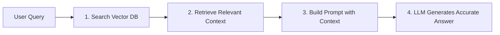

# 🟢 Week 10 - Retrieval-Augmented Generation (RAG)

> [!NOTE] 📋 ภาพรวมเนื้อหา (Overview)
> **ทฤษฎี (2 ชม.):** ข้อจำกัดของ LLM (Hallucination), คอนเซปต์ RAG, Vector Databases  
> **เวิร์กชอป (Workshops):**
> - **Workshop 1:** การสร้าง Text Embeddings และการทำ Chunking เอกสาร PDF
> - **Workshop 2:** การบันทึกและค้นหาข้อมูลใน Vector Database (ChromaDB หรือ Pinecone)
> - **Workshop 3:** การต่อจิ๊กซอว์สร้างระบบ Basic RAG (ดึงข้อมูล $\rightarrow$ ส่งให้ LLM ตอบ)
> - **Workshop 4:** การเพิ่มประสิทธิภาพ RAG (Advanced RAG: Re-ranking & Query Expansion)

---

## 📖 ส่วนที่ 1: สรุปทฤษฎีสำคัญ (Key Theory Concepts)

### 1. ปัญหา Hallucination ของ LLM และทางออกด้วย RAG
LLM ถูกฝึกมาให้ทายคำถัดไป ไม่ได้ถูกออกแบบมาให้เป็นฐานข้อมูล เมื่อถูกถามเรื่องข้อมูลภายในองค์กรหรือข่าวล่าสุด โมเดลจึงมัก **"มั่วข้อมูลอย่างมั่นใจ (Hallucination)"**
- **RAG (Retrieval-Augmented Generation):** การนำ **ระบบค้นหา (Retrieval)** มาต่อกับ **ระบบสร้างข้อความ (Generation)** โดยระบบจะไปค้นหาเอกสารจริงที่เกี่ยวข้องก่อน แล้วยัดใส่ Prompt เพื่อให้ LLM อ่านและสรุปคำตอบจากเอกสารนั้นเท่านั้น



### 2. Vector Databases และ Semantic Search
- **Chunking:** การหั่นเอกสารยาว ๆ (เช่น PDF 100 หน้า) ออกเป็นท่อนสั้น ๆ (เช่น ท่อนละ 500 ตัวอักษร) พร้อมกำหนด Overlap ป้องกันข้อความขาดตอน
- **Vector Database (ChromaDB, Pinecone, Qdrant):** ฐานข้อมูลที่เก็บข้อความในรูปเวกเตอร์ ทำให้ค้นหาข้อความที่มี **"ความหมายคล้ายคลึงกัน (Semantic Similarity)"** ได้ แม้ผู้ใช้จะใช้คำศัพท์ไม่ตรงกับเอกสารเลยก็ตาม

---

## 🛠️ ส่วนที่ 2: เวิร์กชอปเชิงปฏิบัติการ (Hands-on Workshops)

### Workshop 1: การสร้าง Text Embeddings และการทำ Chunking เอกสาร PDF
เขียน Python เพื่อตัดแบ่งข้อความ (Text Chunking) และใช้โมเดล Embedding แปลงข้อความให้เป็นเวกเตอร์

```python
# หมายเหตุ: หากยังไม่ได้ติดตั้ง ให้รัน -> pip install sentence-transformers
from sentence_transformers import SentenceTransformer
import numpy as np

# 1. โหลดโมเดลสำหรับสร้าง Text Embeddings (รองรับภาษาไทยและอังกฤษ)
embedder = SentenceTransformer("paraphrase-multilingual-MiniLM-L12-v2")

# 2. จำลองเอกสารขนาดยาว (Document)
document_text = """
ปัญญาประดิษฐ์ (Artificial Intelligence) คือเทคโนโลยีที่ช่วยให้เครื่องจักรคิดวิเคราะห์ได้
การเรียนรู้ของเครื่อง (Machine Learning) เป็นสาขาย่อยของ AI ที่เน้นการเรียนรู้จากข้อมูล
Deep Learning ใช้โครงข่ายประสาทเทียมหลายชั้นในการแก้ปัญหาที่ซับซ้อนมาก เช่น ภาพและเสียง
ระบบ RAG ช่วยแก้ปัญหาการมั่วข้อมูลของ LLM โดยการดึงเอกสารจริงมาอ้างอิงก่อนตอบคำถาม
"""

# 3. การทำ Text Chunking (หั่นตามบรรทัดหรือขนาดประโยค)
chunks = [chunk.strip() for chunk in document_text.split("\n") if chunk.strip() != ""]
print(f"แบ่งเอกสารออกเป็น {len(chunks)} Chunks:")
for i, c in enumerate(chunks, 1):
    print(f"  Chunk {i}: {c}")

# 4. แปลง Chunks เป็น เวกเตอร์ตัวเลข (Embeddings)
embeddings = embedder.encode(chunks)
print(f"\nขนาดของ Embedding Matrix: {embeddings.shape} ({len(chunks)} ท่อน, ท่อนละ {embeddings.shape[1]} มิติ)")
```

---

### Workshop 2: การบันทึกและค้นหาข้อมูลใน Vector Database (ChromaDB)
ใช้ฐานข้อมูลเวกเตอร์โอเพนซอร์สอย่าง **ChromaDB** ในการจัดเก็บ Chunks และสืบค้นด้วยข้อความคำถาม (Query)

```python
# หมายเหตุ: หากยังไม่ได้ติดตั้ง ให้รัน -> pip install chromadb
import chromadb

# 1. สร้างคลังข้อมูลในหน่วยความจำ (In-memory Vector Database)
chroma_client = chromadb.Client()
collection = chroma_client.create_collection(name="ml_knowledge_base")

# 2. นำ Chunks ที่หั่นไว้เข้าสู่ Vector Database
# ChromaDB มี Built-in Embedding Function ให้ในตัว (หรือเราจะใส่เวกเตอร์เองก็ได้)
collection.add(
    documents=chunks,
    metadatas=[{"source": f"doc_section_{i}"} for i in range(len(chunks))],
    ids=[f"id_{i}" for i in range(len(chunks))]
)
print("บันทึกข้อมูล 4 Chunks ลง ChromaDB เรียบร้อยแล้ว!")

# 3. ค้นหาข้อมูลที่เกี่ยวข้องกับคำถาม (Semantic Search / Top-K Retrieval)
query = "ทำยังไงไม่ให้ AI ตอบมั่วข้อมูล?"
results = collection.query(
    query_texts=[query],
    n_results=2 # ขอ 2 ท่อนที่ใกล้เคียงที่สุด (Top-2)
)

print(f"\n--- ผลการค้นหาสำหรับคำถาม: '{query}' ---")
for doc, meta, dist in zip(results["documents"][0], results["metadatas"][0], results["distances"][0]):
    print(f"👉 [{meta['source']}] (ระยะห่าง: {dist:.4f}) -> {doc}")
```

---

### Workshop 3: การต่อจิ๊กซอว์สร้างระบบ Basic RAG
นำข้อมูลที่ค้นได้จาก ChromaDB (Retrieved Context) มาต่อเข้ากับ Prompt แล้วส่งไปให้ LLM ประมวลผลคำตอบ

```python
def basic_rag_pipeline(user_query, collection, top_k=2):
    # ขั้นตอนที่ 1: Retrieve - ดึงท่อนเอกสารที่เกี่ยวข้องจาก Vector DB
    search_res = collection.query(query_texts=[user_query], n_results=top_k)
    retrieved_docs = search_res["documents"][0]
    
    # นำท่อนเอกสารมารวมกันเป็น Context
    context_str = "\n".join([f"- {doc}" for doc in retrieved_docs])
    
    # ขั้นตอนที่ 2: Augment - สร้าง Prompt สำหรับบังคับ LLM
    augmented_prompt = f"""
คุณคือผู้ช่วย AI องค์กร จงตอบคำถามของผู้ใช้งานโดยใช้ *เฉพาะ* ข้อมูลจากเอกสารอ้างอิงด้านล่างนี้เท่านั้น
หากในเอกสารไม่มีคำตอบ ให้กล่าวอย่างสุภาพว่า "ไม่พบข้อมูลในเอกสารอ้างอิง" ห้ามคิดคำตอบเองเด็ดขาด

[เอกสารอ้างอิง (Context)]:
{context_str}

[คำถามของผู้ใช้]: {user_query}
[คำตอบ]:
"""
    return augmented_prompt, context_str

# --- ทดสอบสร้าง RAG Prompt ---
test_query = "RAG มีประโยชน์อย่างไร?"
final_prompt, retrieved_context = basic_rag_pipeline(test_query, collection)

print("--- เอกสารที่ดึงมาได้ (Retrieved Context) ---")
print(retrieved_context)
print("\n--- พรอมต์ที่พร้อมส่งให้ LLM (Augmented Prompt) ---")
print(final_prompt)
# หมายเหตุ: ในการรันจริง ให้ส่ง final_prompt นี้เข้า client.chat.completions.create()
```

---

### Workshop 4: การเพิ่มประสิทธิภาพ RAG (Advanced RAG: Re-ranking & Query Expansion)
แก้ปัญหาค้นหาไม่เจอด้วยการทำ **Query Expansion (แตกคำถาม)** และการใช้ **Cross-Encoder Re-ranker** จัดลำดับความสำคัญของเอกสารใหม่ให้แม่นยำยิ่งขึ้น

```python
# หมายเหตุ: หากยังไม่ได้ติดตั้ง ให้รัน -> pip install sentence-transformers
from sentence_transformers import CrossEncoder

# 1. โหลดโมเดล Re-ranker (Cross-Encoder จะให้คะแนนความสอดคล้องระหว่าง คำถาม <-> เอกสาร ได้แม่นกว่า Bi-Encoder)
reranker = CrossEncoder('cross-encoder/ms-marco-TinyBERT-L-2-v2')

# 2. สมมติว่าดึงเอกสารมาได้ 4 ท่อนจากการค้นหาระดับแรก (First-stage retrieval)
query = "AI กับ Machine Learning ต่างกันอย่างไร?"
candidate_docs = [
    "Deep Learning ใช้โครงข่ายประสาทเทียมหลายชั้นในการแก้ปัญหา",
    "ปัญญาประดิษฐ์ (AI) คือเทคโนโลยีให้เครื่องคิดได้ ส่วน Machine Learning เป็นสาขาย่อยที่เน้นเรียนรู้จากข้อมูล",
    "ระบบ RAG ช่วยแก้ปัญหาการมั่วข้อมูลของ LLM",
    "การตั้งค่า Environment เป็นสิ่งสำคัญในการป้องกันปัญหา Dependency"
]

# 3. จับคู่คำถามกับเอกสารแต่ละชิ้นเพื่อเตรียมให้ Cross-Encoder ให้คะแนน
pairs = [[query, doc] for doc in candidate_docs]
scores = reranker.predict(pairs)

# 4. เรียงลำดับเอกสารตามคะแนน Re-ranking (จากมากไปน้อย)
ranked_results = sorted(zip(scores, candidate_docs), key=lambda x: x[0], reverse=True)

print("--- ผลการจัดลำดับเอกสารใหม่ด้วย Re-ranker ---")
for rank, (score, doc) in enumerate(ranked_results, 1):
    print(f"อันดับ {rank} (Score: {score:.4f}) -> {doc}")
```

---

## 🔗 อ้างอิงและจุดเชื่อมโยง (Wiki-Links & Next Steps)
- **บทเรียนก่อนหน้า:** [[Week 9 - Generative AI & Prompt Engineering Masterclass]]
- **ภาพรวมเฟส:** [[Phase 3 - Overview|Phase 3: Generative AI & Application Building]]
- **บทเรียนถัดไป:** [[Week 11 - AI Agents & Model Customization]]
- **ความรู้ที่เกี่ยวข้อง:** [[ChromaDB Vector Store]], [[Advanced RAG Architectures]], [[Preventing LLM Hallucinations]]
