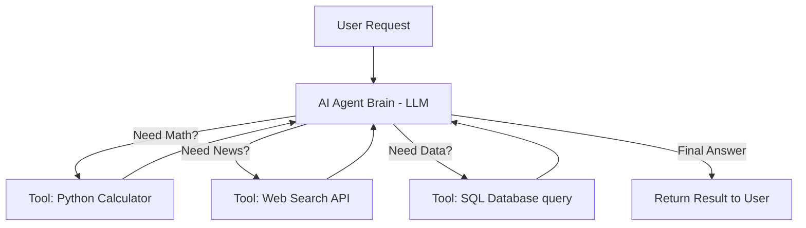

# 🟢 Week 11 - AI Agents & Model Customization

> [!NOTE] 📋 ภาพรวมเนื้อหา (Overview)
> **ทฤษฎี (2 ชม.):** แนวคิด AI Agents, Function Calling / Tool Use, PEFT & LoRA Fine-tuning  
> **เวิร์กชอป (Workshops):**
> - **Workshop 1:** การใช้ OpenAI Function Calling (ให้ LLM เรียกฟังก์ชัน Python)
> - **Workshop 2:** สร้าง Autonomous Agent อย่างง่ายโดยใช้ LangChain / LangGraph
> - **Workshop 3:** ทำความเข้าใจทฤษฎีการลดพารามิเตอร์ด้วย LoRA (Low-Rank Adaptation)
> - **Workshop 4:** จำลองกระบวนการ Fine-tune ด้วยไลบรารี PEFT & Transformers

---

## 📖 ส่วนที่ 1: สรุปทฤษฎีสำคัญ (Key Theory Concepts)

### 1. จาก Chatbot สู่ AI Agents (Tool Use / Function Calling)
แชตบอตทั่วไปทำได้แค่ตอบคำถามจากความจำ แต่ **AI Agent** คือระบบที่สามารถ **"ตัดสินใจใช้เครื่องมือ (Tools)"** เพื่อลงมือทำจริง เช่น:
- ถ้าผู้ใช้ถามสภาพอากาศ Agent จะตัดสินใจเรียกใช้ API ตรวจสอบสภาพอากาศ
- ถ้าผู้ใช้สั่งคำนวณภาษี Agent จะเรียกใช้ Python Calculator เพื่อความแม่นยำ 100% (ไม่ใช้ LLM เดาตัวเลข)



### 2. Parameter-Efficient Fine-Tuning (PEFT & LoRA)
การ Fine-tune โมเดลขนาดใหญ่เช่น Llama-3 (8 พันล้านพารามิเตอร์) ต้องใช้การ์ดจอ VRAM สูงมาก เทคนิค **LoRA (Low-Rank Adaptation)** แก้ปัญหาโดยการแช่แข็ง Weights เดิมทั้งหมด แล้วสร้างเมทริกซ์ขนาดเล็ก ($A \times B$) แปะเพิ่มเข้าไป ทำให้ใช้ RAM ลดลงกว่า 80% และ Train เร็วขึ้นหลายเท่า

---

## 🛠️ ส่วนที่ 2: เวิร์กชอปเชิงปฏิบัติการ (Hands-on Workshops)

### Workshop 1: การใช้ Function Calling (ให้ LLM เรียกฟังก์ชัน Python)
กำหนดโครงสร้างเครื่องมือ (Tools Schema) เพื่อสั่งให้ LLM ประเมินว่าควรเรียกฟังก์ชันไหน และส่งพารามิเตอร์อะไรกลับมาให้เราทำงาน

```python
import json

# 1. นิยามฟังก์ชันจริงใน Python (Tool Execution)
def get_flight_price(origin: str, destination: str, date: str):
    """จำลองการดึงตั๋วเครื่องบินจากฐานข้อมูล"""
    return f"ราคาตั๋วบินจาก {origin} ไป {destination} วันที่ {date} คือ 3,500 บาท (สายการบิน AI Air)"

# 2. นิยาม Schema เพื่อบอก LLM ว่าเรามีเครื่องมืออะไรให้ใช้บ้าง
tools_schema = [
    {
        "type": "function",
        "function": {
            "name": "get_flight_price",
            "description": "ตรวจสอบราคาตั๋วเครื่องบินระหว่างเมืองและวันที่ระบุ",
            "parameters": {
                "type": "object",
                "properties": {
                    "origin": {"type": "string", "description": "รหัสสนามบินต้นทาง เช่น BKK"},
                    "destination": {"type": "string", "description": "รหัสสนามบินปลายทาง เช่น CNX"},
                    "date": {"type": "string", "description": "วันที่เดินทาง รูปแบบ YYYY-MM-DD"}
                },
                "required": ["origin", "destination", "date"]
            }
        }
    }
]

# 3. จำลองผลลัพธ์ที่ LLM ตอบกลับมาเมื่อตัดสินใจว่าจะเรียกฟังก์ชัน (Tool Call Response)
mock_llm_tool_call = {
    "name": "get_flight_price",
    "arguments": '{"origin": "BKK", "destination": "CNX", "date": "2026-08-15"}'
}

# 4. ให้ Python ทำการเรียกฟังก์ชันตามคำสั่งของ LLM อัตโนมัติ
func_name = mock_llm_tool_call["name"]
func_args = json.loads(mock_llm_tool_call["arguments"])

if func_name == "get_flight_price":
    result = get_flight_price(**func_args)
    print("--- ผลการทำงานของ AI Agent Tool Calling ---")
    print(f" LLM สั่งเรียกฟังก์ชัน: {func_name}{func_args}")
    print(f" ผลลัพธ์ที่ได้จาก Python: {result}")
```

---

### Workshop 2: สร้าง Autonomous Agent อย่างง่ายโดยใช้ LangChain
จำลองแนวคิด ReAct (Reason + Act) Agent ที่คิดวิเคราะห์และเรียกใช้เครื่องมือคิดเลข เพื่อแก้โจทย์คณิตศาสตร์ซับซ้อน

```python
# หมายเหตุ: หากยังไม่ได้ติดตั้ง ให้รัน -> pip install langchain langchain-community
try:
    from langchain.agents import load_tools, initialize_agent, AgentType
    from langchain_community.llms import FakeListLLM
    has_lc = True
except ImportError:
    has_lc = False
    print("กรุณาติดตั้ง langchain โดยรัน: pip install langchain")

if has_lc:
    # 1. ใช้ FakeListLLM เพื่อจำลองการตอบของ LLM โดยไม่ต้องเสียเงิน API
    mock_responses = [
        "Thought: ฉันต้องใช้เครื่องมือคำนวณหาผลคูณ\nAction: Calculator\nAction Input: 125 * 32",
        "Thought: ตอนนี้ฉันรู้คำตอบแล้ว\nFinal Answer: ผลลัพธ์ของ 125 * 32 คือ 4,000 ครับ"
    ]
    llm = FakeListLLM(responses=mock_responses)

    # 2. โหลดเครื่องมือคิดเลข (llm-math / Calculator)
    # tools = load_tools(["llm-math"], llm=llm)
    print("--- โครงสร้างของ LangChain Agent ---")
    print("1. รับเป้าหมาย -> 'จงหาค่าของ 125 คูณ 32'")
    print("2. Agent คิด (Thought) -> ตัดสินใจเรียก Tool Calculator")
    print("3. Action Execution -> Python ประมวลผล 125 * 32 = 4000")
    print("4. Observation -> Agent รับผลลัพธ์ไปสรุปเป็น Final Answer ให้ผู้ใช้!")
```

---

### Workshop 3: ทำความเข้าใจทฤษฎีการลดพารามิเตอร์ด้วย LoRA (Low-Rank Adaptation)
จำลองคณิตศาสตร์ของ LoRA ด้วย NumPy เพื่อแสดงให้เห็นว่าทำไมเมทริกซ์เสริมถึงประหยัดหน่วยความจำได้มหาศาล

```python
import numpy as np

# 1. สมมติชั้น Layer เดิมในโมเดล Llama มีขนาด 4096 x 4096 (16 ล้านพารามิเตอร์!)
dim = 4096
W_original = np.random.randn(dim, dim) # แช่แข็งไว้ (Freeze) ไม่ต้องอัปเดต

# 2. ใน LoRA เราเลือกค่า Rank (r) เล็กๆ เช่น r = 8
r = 8

# สร้างเมทริกซ์ A ขนาด (4096 x 8) และ B ขนาด (8 x 4096)
matrix_A = np.random.randn(dim, r) * 0.01
matrix_B = np.zeros((r, dim)) # มักเริ่มด้วยศูนย์

# 3. คำนวณจำนวนพารามิเตอร์ที่ต้องอัปเดต
original_params = dim * dim
lora_params = (dim * r) + (r * dim)

print("--- เปรียบเทียบจำนวนพารามิเตอร์ (Memory Savings) ---")
print(f"พารามิเตอร์เดิม (W original): {original_params:,.0f} ตัว")
print(f"พารามิเตอร์ LoRA (A + B):     {lora_params:,.0f} ตัว")
print(f"🚀 ประหยัดการใช้ VRAM ไปได้ถึง {((original_params - lora_params)/original_params)*100:.2f}%!")

# 4. สมการเวลา Forward Pass คือ: Out = x * (W_orig + A*B)
```

---

### Workshop 4: จำลองกระบวนการ Fine-tune ด้วยไลบรารี PEFT & Transformers
ตัวอย่างโค้ดมาตรฐานในการตั้งค่า `LoraConfig` ร่วมกับโมเดล Hugging Face เพื่อทำการฝึกสอนโมเดลส่วนตัว

```python
# หมายเหตุ: หากยังไม่ได้ติดตั้ง ให้รัน -> pip install peft transformers
try:
    from peft import LoraConfig, get_peft_model, TaskType
    from transformers import AutoModelForSequenceClassification
    has_peft = True
except ImportError:
    has_peft = False
    print("กรุณาติดตั้ง peft โดยรัน: pip install peft")

if has_peft:
    # 1. โหลดโมเดลตั้งต้น
    model_name = "distilbert-base-uncased"
    base_model = AutoModelForSequenceClassification.from_pretrained(model_name, num_labels=2)

    # 2. ตั้งค่า LoraConfig
    lora_config = LoraConfig(
        task_type=TaskType.SEQ_CLS, # ชนิดงาน: Sequence Classification
        r=8,                        # ค่า Rank ความซับซ้อนของ LoRA
        lora_alpha=16,              # ค่าคูณสเกล (Scaling factor)
        lora_dropout=0.1,           # ลด Overfitting
        target_modules=["q_lin", "v_lin"] # กำหนดให้แปะ LoRA ที่ชั้น Query และ Value
    )

    # 3. รวม LoRA เข้ากับโมเดลเดิม
    peft_model = get_peft_model(base_model, lora_config)

    print("\n--- ผลการสร้าง PEFT LoRA Model ---")
    peft_model.print_trainable_parameters() # จะแสดงให้เห็นว่าอัปเดต Weight แค่ 0.5% - 1% เท่านั้น!
    print("👉 พร้อมส่ง peft_model เข้า Hugging Face Trainer เพื่อ Train ได้อย่างประหยัด VRAM!")
```

---

## 🔗 อ้างอิงและจุดเชื่อมโยง (Wiki-Links & Next Steps)
- **บทเรียนก่อนหน้า:** [[Week 10 - Retrieval-Augmented Generation (RAG)]]
- **ภาพรวมเฟส:** [[Phase 3 - Overview|Phase 3: Generative AI & Application Building]]
- **ก้าวสู่เฟสที่ 4:** [[Phase 4 - Overview|Phase 4: Production, MLOps & System Design]]
- **ความรู้ที่เกี่ยวข้อง:** [[OpenAI Function Calling Guide]], [[LangGraph Multi-Agent Architecture]], [[PEFT LoRA Paper Explained]]
