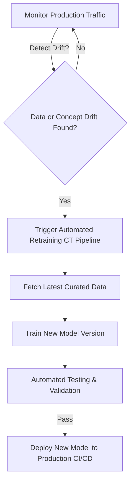

# 🟢 Week 14 - MLOps, Monitoring & Maintenance

> [!NOTE] 📋 ภาพรวมเนื้อหา (Overview)
> **ทฤษฎี (2 ชม.):** การเสื่อมสภาพของโมเดล (Model Decay / Drift), CI/CD/CT ใน MLOps  
> **เวิร์กชอป (Workshops):**
> - **Workshop 1:** การใช้ Evidently AI ตรวจจับ Data Drift และ Concept Drift
> - **Workshop 2:** สร้าง Automated Pipeline สำหรับ Retraining โมเดลเมื่อประสิทธิภาพตก
> - **Workshop 3:** การส่งออก Metrics เพื่อแสดงผลบน Dashboard (Prometheus & Grafana)
> - **Workshop 4:** สรุปแนวปฏิบัติการทำ Continuous Training (CT) ในระบบ MLOps

---

## 📖 ส่วนที่ 1: สรุปทฤษฎีสำคัญ (Key Theory Concepts)

### 1. ทำไมโมเดล ML ถึงเสื่อมประสิทธิภาพเมื่อเวลาผ่านไป? (Model Decay)
ซอฟต์แวร์ทั่วไปเมื่อเขียนเสร็จแล้วจะไม่พังตราบใดที่โค้ดไม่เปลี่ยน แต่ระบบ ML สามารถ **"โง่ลงได้อย่างรวดเร็ว"** เนื่องจากสิ่งแวดล้อมและพฤติกรรมมนุษย์เปลี่ยนแปลงไป ปัญหานี้เรียกว่า:
- **Data Drift:** การกระจายตัวของข้อมูลนำเข้า (Input Features) เปลี่ยนไปจากตอน Train เช่น ตอน Train มีแต่ลูกค้าอายุ 20-30 ปี แต่อยู่ๆ ก็มีลูกค้ากลุ่ม 50-60 ปีเข้ามาใช้งานแอปจำนวนมาก
- **Concept Drift:** ความสัมพันธ์ระหว่างฟีเจอร์และเลเบลเปลี่ยนไป เช่น ก่อนเกิดวิกฤตเศรษฐกิจ คนรายได้ 50,000 มีความสามารถในการผ่อนบ้านสูง แต่หลังเงินเฟ้อรุนแรง คนกลุ่มเดิมไม่สามารถผ่อนชำระได้แล้ว



### 2. มิติของ CI / CD / CT ในระบบ MLOps
- **CI (Continuous Integration):** ตรวจสอบคุณภาพโค้ดและทดสอบ Data Pipeline (Unit Tests)
- **CD (Continuous Delivery / Deployment):** นำส่ง API หรือ Container ของโมเดลเวอร์ชันใหม่ขึ้น Production อย่างปลอดภัย (Canary Deployment)
- **CT (Continuous Training):** ระบบอัตโนมัติในการดึงข้อมูลใหม่มาอบรมโมเดลทันทีเมื่อพบว่า Drift เกินเกณฑ์มาตรฐาน

---

## 🛠️ ส่วนที่ 2: เวิร์กชอปเชิงปฏิบัติการ (Hands-on Workshops)

### Workshop 1: การใช้ Evidently AI ตรวจจับ Data Drift
เขียน Python เพื่อใช้ไลบรารี **Evidently AI** เปรียบเทียบข้อมูลตอน Train (Reference Data) กับข้อมูลที่ได้จาก Production (Current Data)

```python
# หมายเหตุ: หากยังไม่ได้ติดตั้ง ให้รัน -> pip install evidently pandas scikit-learn
try:
    import pandas as pd
    import numpy as np
    from sklearn.datasets import load_iris
    from evidently.report import Report
    from evidently.metric_preset import DataDriftPreset
    has_evidently = True
except ImportError:
    has_evidently = False
    print("กรุณาติดตั้ง evidently โดยรัน: pip install evidently")

if has_evidently:
    # 1. โหลดข้อมูลมาตรฐาน
    iris = load_iris(as_frame=True)
    df_reference = iris.frame # ชุดข้อมูลตอน Train (Reference)
    
    # 2. จำลองข้อมูลจาก Production ที่เกิด Data Drift (เช่น ดอกไม้มีขนาดใบใหญ่ผิดปกติ 2 เท่า)
    df_current = df_reference.copy()
    df_current['sepal length (cm)'] = df_current['sepal length (cm)'] * 1.8
    df_current['petal width (cm)']  = df_current['petal width (cm)'] + 2.0

    # 3. สร้างรายงานตรวจสอบ Data Drift
    drift_report = Report(metrics=[DataDriftPreset()])
    drift_report.run(reference_data=df_reference, current_data=df_current)
    
    # 4. ดึงผลสรุปออกมาดูใน Terminal
    summary = drift_report.as_dict()
    drift_share = summary["metrics"][0]["result"]["drift_share"]
    dataset_drift = summary["metrics"][0]["result"]["dataset_drift"]

    print("--- ผลการตรวจสอบ Data Drift ด้วย Evidently AI ---")
    print(f"สัดส่วนของคอลัมน์ที่เกิด Drift: {drift_share * 100:.1f}%")
    print(f"สถานะ Dataset Drift ทั้งระบบ:    {'⚠️ ตรวจพบ Drift รุนแรง!' if dataset_drift else '✅ ข้อมูลปกติ'}")
    
    # สามารถส่งออกเป็นไฟล์ HTML รายงานสวยงามได้
    # drift_report.save_html("data_drift_report.html")
```

---

### Workshop 2: สร้าง Automated Pipeline สำหรับ Retraining โมเดล
จำลองตรรกะระบบ CT (Continuous Training) ที่เมื่อพบว่าความแม่นยำตกต่ำกว่าเกณฑ์ ระบบจะทำการฝึกสอนโมเดลเวอร์ชันใหม่ทันที

```python
import numpy as np
from sklearn.ensemble import RandomForestClassifier
from sklearn.metrics import accuracy_score

class AutomatedRetrainingPipeline:
    def __init__(self, threshold=0.80):
        self.acc_threshold = threshold
        self.current_model = RandomForestClassifier(random_state=42)
        self.model_version = 1
        
        # Train โมเดลเริ่มต้น
        X_init = np.random.rand(200, 5)
        y_init = np.random.randint(0, 2, size=200)
        self.current_model.fit(X_init, y_init)

    def monitor_and_retrain(self, X_live, y_live):
        """ตรวจสอบความแม่นยำบนข้อมูลสด ถ้าต่ำกว่าเกณฑ์จะสั่ง Retrain"""
        # 1. ประเมินผลบนข้อมูล Live Traffic
        preds = self.current_model.predict(X_live)
        live_acc = accuracy_score(y_live, preds)
        print(f"\n📊 [Model v{self.model_version}] ความแม่นยำบน Live Data: {live_acc*100:.2f}%")

        # 2. ตรวจสอบว่าต่ำกว่า Threshold หรือไม่
        if live_acc < self.acc_threshold:
            print(f"⚠️ คำเตือน: ความแม่นยำต่ำกว่าเกณฑ์ ({self.acc_threshold*100:.0f}%) -> 🤖 เริ่มกระบวนการ Retraining อัตโนมัติ!")
            
            # ดึงข้อมูลใหม่มาฝึกสอนทับโมเดลเดิม
            self.current_model.fit(X_live, y_live)
            self.model_version += 1
            
            # ตรวจสอบความแม่นยำหลัง Retrain
            new_acc = self.current_model.score(X_live, y_live)
            print(f"🎉 Retrain สำเร็จ! อัปเกรดเป็น [Model v{self.model_version}] ความแม่นยำพุ่งขึ้นเป็น: {new_acc*100:.2f}%")
            return True
        else:
            print("✅ ประสิทธิภาพโมเดลยังคงอยู่ในเกณฑ์ดีเยี่ยม ไม่จำเป็นต้อง Retrain")
            return False

# ทดสอบระบบ
pipeline = AutomatedRetrainingPipeline(threshold=0.75)

# จำลองข้อมูลชุดที่ 1: ข้อมูลยังปกติ
pipeline.monitor_and_retrain(np.random.rand(50, 5), np.random.randint(0, 2, size=50))

# จำลองข้อมูลชุดที่ 2: เกิด Concept Drift ทำให้โมเดลทายผิดกระจาย (Accuracy ตก)
bad_X = np.random.rand(50, 5) * 10
bad_y = np.ones(50) # เลเบลเปลี่ยนเป็น 1 ทั้งหมด
pipeline.monitor_and_retrain(bad_X, bad_y)
```

---

### Workshop 3: การส่งออก Metrics เพื่อแสดงผลบน Dashboard (Prometheus)
เขียน Python สคริปต์เพื่อสร้าง Endpoint บริการตัวเลขสถิติ (Metrics) ในรูปแบบที่เครื่องมือ Monitoring ระดับโลกอย่าง **Prometheus และ Grafana** สามารถเข้ามาดึงไปวาดกราฟได้

```python
# หมายเหตุ: หากยังไม่ได้ติดตั้ง ให้รัน -> pip install prometheus-client
try:
    from prometheus_client import start_http_server, Counter, Gauge, Histogram
    import time
    import random
    has_prom = True
except ImportError:
    has_prom = False
    print("กรุณาติดตั้ง prometheus-client โดยรัน: pip install prometheus-client")

if has_prom:
    # 1. กำหนดตัวชี้วัดที่ต้องการตรวจจับในระบบ ML
    INFERENCE_COUNT = Counter("ml_inference_total", "จำนวนครั้งที่มีการเรียกขอผลทำนาย")
    PREDICTION_VALUE = Gauge("ml_prediction_class", "คลาสล่าสุดที่โมเดลพยากรณ์ได้ (0 หรือ 1)")
    INFERENCE_LATENCY = Histogram("ml_inference_latency_seconds", "เวลาที่ใช้ในการคำนวณ Inference (วินาที)")

    def mock_inference_job():
        """จำลองการยิง Request จากผู้ใช้เข้ามาที่ระบบ ML"""
        start_t = time.time()
        
        # จำลองคิดคำตอบ
        time.sleep(random.uniform(0.01, 0.1))
        pred = random.choice([0, 1])
        
        # บันทึกค่าลง Prometheus Metrics
        INFERENCE_COUNT.inc()           # นับเพิ่ม 1
        PREDICTION_VALUE.set(pred)      # บันทึกค่าที่ทายได้
        INFERENCE_LATENCY.observe(time.time() - start_t) # บันทึกเวลา Latency

    print("--- โครงสร้าง Prometheus Metrics Exporter ---")
    print("เมื่อเปิดเซิร์ฟเวอร์ด้วย start_http_server(8000) ระบบจะเปิดพอร์ต /metrics")
    print("เพื่อให้ Prometheus Server เข้ามา Scrape ตัวเลขสถิติไปแสดงบนแดชบอร์ด Grafana ได้ทันที")
    # ตัวอย่างการรัน (คอมเมนต์ไว้เพื่อไม่ให้บล็อกการทำงาน):
    # start_http_server(8080)
    # while True:
    #     mock_inference_job()
    #     time.sleep(1)
```

---

### Workshop 4: สรุปแนวปฏิบัติการทำ Continuous Training (CT) ในระบบ MLOps
เช็กลิสต์สำคัญ 5 ข้อในการสร้างระบบ MLOps ระดับ Enterprise ที่มีเสถียรภาพสูง

1. **Automated Data Validation:** ทุกครั้งที่มีข้อมูลใหม่ไหลเข้าสู่ระบบ ต้องมีการตรวจสอบสคีมา (Data Types, Missing Values, Outliers) อัตโนมัติก่อนส่งเข้าโมเดล
2. **Experiment & Model Versioning:** เก็บประวัติการ Train ทุกครั้งด้วย MLflow หรือ Weights & Biases เพื่อให้สามารถย้อนกลับ (Rollback) ไปเวอร์ชันก่อนหน้าได้ทันทีถ้าโมเดลใหม่มีปัญหา
3. **Shadow Deployment:** เวลา Deploy โมเดลเวอร์ชันใหม่ ให้รันขนานไปกับโมเดลเดิมโดยยังไม่ส่งผลตอบกลับให้ลูกค้าจริง (Shadow mode) เพื่อทดสอบความเสถียรก่อน
4. **Automated Alerting:** ตั้งระบบแจ้งเตือนผ่าน Slack หรือ PagerDuty ทันทีเมื่อ Latency ของ API สูงเกิน 200ms หรือเมื่อค่า Data Drift พุ่งสูงผิดปกติ
5. **Human-in-the-Loop:** แม้ระบบ Retrain จะเป็นอัตโนมัติ แต่การอนุมัตินำโมเดลขึ้นใช้งานจริงบน Production (Promotion to Production) ในงานที่ละเอียดอ่อนควรผ่านการอนุมัติจาก Lead Data Scientist เสมอ

---

## 🔗 อ้างอิงและจุดเชื่อมโยง (Wiki-Links & Next Steps)
- **บทเรียนก่อนหน้า:** [[Week 13 - Model Deployment & Serving]]
- **ภาพรวมเฟส:** [[Phase 4 - Overview|Phase 4: Production, MLOps & System Design]]
- **ก้าวสู่เฟสสุดท้าย:** [[Phase 5 - Overview|Phase 5: Capstone Project]]
- **ความรู้ที่เกี่ยวข้อง:** [[Evidently AI Drift Detection]], [[Grafana ML Dashboards]], [[MLOps Architecture Guide]]
