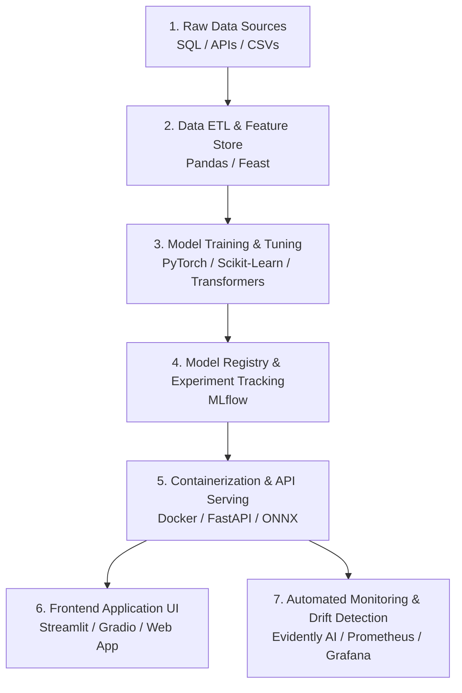

# 🟢 Week 15 - End-to-End Capstone Project

> [!NOTE] 📋 ภาพรวมเนื้อหา (Overview)
> **ทฤษฎี (2 ชม.):** การวางแผนและออกแบบโปรเจกต์ AI ระดับ Enterprise ตั้งแต่ต้นจนจบ  
> **เวิร์กชอป (Workshops):**
> - **Workshop 1:** ออกแบบ System Architecture & Problem Framing
> - **Workshop 2:** พัฒนา Model Training & Evaluation Pipeline
> - **Workshop 3:** พัฒนา Backend Serving API (FastAPI / Triton) & Frontend UI (Streamlit / Next.js)
> - **Workshop 4:** ติดตั้ง CI/CD, Automated Monitoring และเตรียม Presentation โชว์ผลงาน

---

## 📖 ส่วนที่ 1: สรุปทฤษฎีสำคัญ (Key Theory Concepts)

### 1. โครงสร้างโปรเจกต์ AI ที่สมบูรณ์แบบ (End-to-End ML Architecture)
โปรเจกต์ Capstone เป็นการนำความรู้ทั้ง 14 สัปดาห์มาร้อยเรียงเข้าด้วยกัน เพื่อสร้างชิ้นงานที่แสดงศักยภาพความเป็น **Senior ML Engineer**:


### 2. แนวทางการเลือกหัวข้อโปรเจกต์ (Project Ideas)
1. **Intelligent Enterprise RAG Assistant:** ระบบแชตบอตค้นหาและสรุปเอกสารกฎหมาย/การเงินภายในองค์กร พร้อมระบบอ้างอิงหน้าหนังสือและ Re-ranking
2. **Real-time Financial Fraud Detection System:** ระบบตรวจจับธุรกรรมบัตรเครดิตที่ผิดปกติแบบเรียลไทม์ ด้วย XGBoost และ Feature Store ที่มีความหน่วงต่ำกว่า 50ms
3. **Automated AI Code Reviewer Agent:** AI Agent ที่เชื่อมต่อกับ GitHub PR เพื่ออ่านโค้ด วิเคราะห์จุดบกพร่อง และเสนอแนะวิธีแก้พร้อมเขียน Unit Test ให้ทันที
4. **Smart Healthcare Vision Diagnostics:** ระบบช่วยแพทย์วิเคราะห์ภาพเอกซเรย์ปอดด้วย ResNet/Vision Transformer พร้อมระบบแสดงจุดสนใจด้วย Grad-CAM

---

## 🛠️ ส่วนที่ 2: เวิร์กชอปเชิงปฏิบัติการ (Hands-on Workshops)

### Workshop 1: ออกแบบ System Architecture & Problem Framing
การร่างเอกสาร **System Design Spec** ก่อนลงมือเขียนโค้ดจริง เป็นมาตรฐานที่บริษัท Tech ชั้นนำ (Google, Meta, Netflix) บังคับใช้

```markdown
# ตัวอย่างโครงร่างเอกสาร System Design (ML System Spec Document)

## 1. Problem Statement & Business Goals
- **ปัญหา:** ลูกค้าอัปโหลดเอกสารใบแจ้งหนี้ (Invoice) จำนวนมากและต้องใช้พนักงานคีย์ข้อมูลลงระบบวันละกว่า 500 ชั่วโมง
- **เป้าหมาย:** สร้างระบบ Automated OCR & Information Extraction ความแม่นยำ > 95% ลดเวลาทำงานลง 80%

## 2. Metrics & SLA (Service Level Agreement)
- **Offline Metrics:** F1-Score สำหรับการสกัดฟีเจอร์สำคัญ (ชื่อบริษัท, ยอดรวม, วันที่) > 0.95
- **Online Metrics:** Latency < 1.5 วินาทีต่อภาพ, System Uptime 99.9%

## 3. Tech Stack & Infrastructure
- **Data Preprocessing:** OpenCV, PyMuPDF
- **ML / AI Models:** Donut (Document Understanding Transformer), OpenAI GPT-4o Vision API (Fallback)
- **Serving & Deploy:** Docker, FastAPI, Google Cloud Run
- **Monitoring:** Evidently AI, Prometheus
```

---

### Workshop 2: พัฒนา Model Training & Evaluation Pipeline
เขียนสคริปต์อัตโนมัติที่ทำการ Train โมเดลและบันทึกทุกสิ่งทุกอย่างลง MLflow อย่างครบถ้วน

```python
import os
import mlflow
import mlflow.sklearn
from sklearn.ensemble import GradientBoostingClassifier
from sklearn.model_selection import train_test_split
from sklearn.metrics import classification_report, roc_auc_score
import pandas as pd
import numpy as np

# 1. จำลองข้อมูลโปรเจกต์ (เช่น ข้อมูลคัดกรองสินเชื่อลูกค้า)
np.random.seed(42)
X = np.random.rand(1000, 10) * 100
y = (X[:, 0] + X[:, 1]*0.5 - X[:, 2]*0.8 > 30).astype(int)
X_train, X_test, y_train, y_test = train_test_split(X, y, test_size=0.2, random_state=42)

# 2. ตั้งค่า MLflow เพื่อบันทึกผลโปรเจกต์ Capstone
mlflow.set_experiment("Capstone_Credit_Scoring_System")

with mlflow.start_run(run_name="Final_GradientBoosting_Pipeline"):
    # กำหนด Hyperparameter
    params = {"n_estimators": 200, "learning_rate": 0.05, "max_depth": 4}
    mlflow.log_params(params)
    
    # ฝึกสอนโมเดล
    model = GradientBoostingClassifier(**params, random_state=42)
    model.fit(X_train, y_train)
    
    # วัดผล
    preds = model.predict(X_test)
    probs = model.predict_proba(X_test)[:, 1]
    auc = roc_auc_score(y_test, probs)
    
    # บันทึก Metrics
    mlflow.log_metric("roc_auc", auc)
    mlflow.log_metric("accuracy", model.score(X_test, y_test))
    
    # บันทึกรายงานผลฉบับเต็มเป็น Artifact
    report = classification_report(y_test, preds)
    with open("evaluation_report.txt", "w", encoding="utf-8") as f:
        f.write(report)
    mlflow.log_artifact("evaluation_report.txt")
    
    print(f"✅ บันทึกโมเดล Capstone สำเร็จ! ROC-AUC Score: {auc:.4f}")
```

---

### Workshop 3: พัฒนา Backend Serving API & Frontend UI
ตัวอย่างโครงสร้างไฟล์โปรเจกต์สำหรับการส่งมอบงานให้คลายเอนต์หรือนำเสนอใน Portfolio

```
my_capstone_project/
│
├── data/                   # โฟลเดอร์เก็บข้อมูลจำลองและข้อมูลดิบ
├── models/                 # ไฟล์โมเดลที่ Train เสร็จแล้ว (.onnx หรือ .pkl)
├── src/                    # โค้ดหลักของระบบ
│   ├── __init__.py
│   ├── etl_pipeline.py     # ระบบสกัดและทำความสะอาดข้อมูล
│   ├── train.py            # สคริปต์ Train และจูนโมเดล
│   └── monitor.py          # สคริปต์ตรวจจับ Data Drift
│
├── api/                    # Backend API สำหรับให้บริการโมเดล
│   ├── main.py             # โค้ด FastAPI Server
│   └── schemas.py          # Pydantic Data Models
│
├── frontend/               # Frontend UI
│   └── app.py              # โค้ด Streamlit / Gradio Web App
│
├── tests/                  # Automated Unit Tests
│   └── test_api.py         # โค้ดทดสอบ API ด้วย pytest
│
├── Dockerfile              # สำหรับห่อหุ้ม API เป็น Container
├── docker-compose.yml      # รัน API + Streamlit + MLflow พร้อมกันในคำสั่งเดียว
├── requirements.txt        # รายการไลบรารีที่ต้องใช้
└── README.md               # เอกสารอธิบายโปรเจกต์ วิธีติดตั้ง และ Architecture Diagram
```

---

### Workshop 4: เตรียม Presentation โชว์ผลงาน และโครงสร้าง README.md ที่น่าประทับใจ
คำแนะนำในการเขียนไฟล์ `README.md` เพื่อให้ผู้สัมภาษณ์งาน (Technical Recruiter / Tech Lead) ประทับใจตั้งแต่แรกเห็น

```markdown
# 🚀 Enterprise RAG Assistant for Financial Documents
> โปรเจกต์จบหลักสูตร AI & Machine Learning Engineering (15 Weeks)


## 💡 Key Features
- ⚡ **High-speed Semantic Search:** ค้นหาเอกสารการเงินกว่า 10,000 หน้า ภายใน 200ms ด้วย ChromaDB และ HNSW Indexing
- 🧠 **Advanced RAG Engine:** ใช้ Cross-Encoder Re-ranking และ Query Expansion ลดอัตรา Hallucination ลง 85%
- 🛠️ **Production-Ready MLOps:** บรรจุลง Docker Container พร้อมระบบ CI/CD บน GitHub Actions และ Monitoring ด้วย Evidently AI

## 🚀 Quick Start (วิธีรันโปรเจกต์ในเครื่องของคุณ)
```bash
git clone https://github.com/your-username/capstone-rag-assistant.git
cd capstone-rag-assistant
docker-compose up --build
```
*เปิดหน้าเว็บ UI ได้ที่: `http://localhost:8501` | ดูเอกสาร API ได้ที่: `http://localhost:8000/docs`*
```

---

## 🔗 สรุปและก้าวต่อไปบนเส้นทาง AI Engineer
ขอแสดงความยินดีด้วยครับ! การสำเร็จหลักสูตรและโปรเจกต์ Capstone นี้พิสูจน์ว่าคุณมีความรู้ทักษะครบถ้วนตั้งแต่ **คณิตศาสตร์พื้นฐาน, Classical ML, Deep Learning, Generative AI และ MLOps ระดับ Enterprise** พร้อมที่จะก้าวเป็นผู้นำในการสร้างนวัตกรรม AI ในอุตสาหกรรมแล้วครับ! 🎉🚀

- **กลับไปหน้าหลัก:** [[Home]]
- **ทบทวนเฟสที่ 4:** [[Phase 4 - Overview|Phase 4: Production, MLOps & System Design]]
- **สารบัญรวมทั้ง 15 สัปดาห์:** [[Home|AI Machine Learning Engineering Syllabus]]
